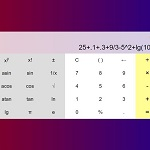

### Hi there 👋

<!--

prettier-ignore
-->
Covid Dashboard | Game "Balda" | Momentum | Calculator
--- | --- | --- | ---
 |  |  | 
| [:briefcase: Repo](https://github.com/ryabykhms/covid-dashboard) [:arrow_forward: Deploy](https://ryabykhms-covid-dashboard.netlify.app/)  | [:briefcase: Repo](https://github.com/ryabykhms/rsclone) [:arrow_forward: Deploy](https://rsclone-balda.netlify.app/)  | [:briefcase: Repo](https://github.com/ryabykhms/momentum) [:arrow_forward: Deploy](https://rolling-scopes-school.github.io/ryabykhms-JS2020Q3/momentum/) | [:briefcase: Repo](https://github.com/ryabykhms/js-calc) [React](https://github.com/ryabykhms/react-calc) [:arrow_forward: Deploy](https://rolling-scopes-school.github.io/ryabykhms-JS2020Q3/calculator/) |
|   |      |    |     |

<!--

prettier-ignore
-->
Shelter | Gem Puzzle | Virtual Keyboard | Tic Tac Toe
--- | --- | --- | ---
 |  |  | 
| [:briefcase: Repo](https://github.com/ryabykhms/shelter) [:arrow_forward: Deploy](https://rolling-scopes-school.github.io/ryabykhms-JS2020Q3/shelter/pages/main/)  | [:briefcase: Repo](https://github.com/ryabykhms/gem-puzzle) [:arrow_forward: Deploy](https://rolling-scopes-school.github.io/ryabykhms-JS2020Q3/gem-puzzle/)  | [:briefcase: Repo](https://github.com/ryabykhms/virtual-keyboard) [:arrow_forward: Deploy](https://rolling-scopes-school.github.io/ryabykhms-JS2020Q3/virtual-keyboard/) | [:briefcase: Repo](https://github.com/ryabykhms/tic-tac-toe) |
|    |    |    |   

 
 

## 💼 Skills

<!--
**ryabykhms/ryabykhms** is a ✨ _special_ ✨ repository because its `README.md` (this file) appears on your GitHub profile.

Here are some ideas to get you started:

- 🔭 I’m currently working on ...
- 🌱 I’m currently learning ...
- 👯 I’m looking to collaborate on ...
- 🤔 I’m looking for help with ...
- 💬 Ask me about ...
- 📫 How to reach me: ...
- 😄 Pronouns: ...
- ⚡ Fun fact: ...
-->
